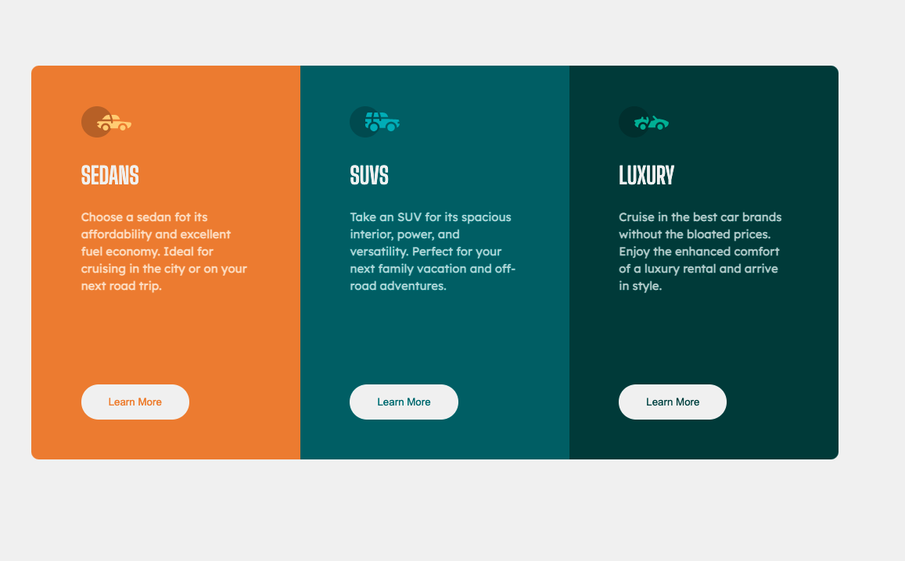
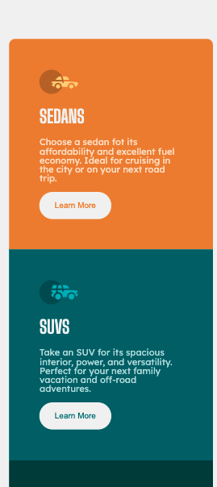

# Frontend Mentor - 3-column preview card component solution

This is a solution to the [3-column preview card component challenge on Frontend Mentor](https://www.frontendmentor.io/challenges/3column-preview-card-component-pH92eAR2-). Frontend Mentor challenges help you improve your coding skills by building realistic projects. 

## Table of contents

- [Overview](#overview)
  - [The challenge](#the-challenge)
  - [Screenshot](#screenshot)
  - [Links](#links)
- [My process](#my-process)
  - [Built with](#built-with)
  - [What I learned](#what-i-learned)
  - [Continued development](#continued-development)
  - [Useful resources](#useful-resources)
- [Author](#author)
- [Acknowledgments](#acknowledgments)

## Overview

### The challenge

Users should be able to:

- View the optimal layout depending on their device's screen size
- See hover states for interactive elements

### Screenshot



### Links

- Solution URL: [Add solution URL here](https://your-solution-url.com)
- Live Site URL: [Add live site URL here](https://your-live-site-url.com)

## My process

### Built with

- Semantic HTML5 markup
- CSS custom properties
- Flexbox
- CSS Grid
- Mobile-first workflow

### What I learned

This challenge was about remembering to do mobile first and taking breaks. Coding at peak concentration states proved way more productive than forming myself to keep going. Taking breaks every 45mins is the way to go

Code wise I'm not particularly happy with this workaroudn to keep the buttoms always at the same level
```css
    p {
        min-height: 300px;
    }
```
Instead of working on the buttons I made the paragraths that alwyas come in front of them have a fixed height. Stopping the text from occupying different view heights on different cards.


### Continued development

Another best practice to keep doing is to configure for media in between 1440 and 400 (desktop and mobile). Just because the design works on the most commom screen sizes, it doesn't mean it will work for the in between

### Useful resources

W3Schools once again proves itself to be very helful
https://www.w3schools.com/cssref/css3_pr_mediaquery.asp

Also, this youtube video shows how to upload to github and create live server solutions for this project: https://www.youtube.com/watch?v=2tlbKm8_4mg&list=LL&index=2
Just wait until minute 44, that's when things get interesting

## Author

- Website - [Rodrigo Barbosa](https://gelatodigital.com)
- Frontend Mentor - [@yourusername](https://www.frontendmentor.io/profile/Rod-Barbosa)

## Acknowledgments

Once again thank you for hte moral support. A quick instagram reel upload of me working on the last solution got 87 plays by the tiem I'm writing this. Thank you all for showing interest in something so small.
